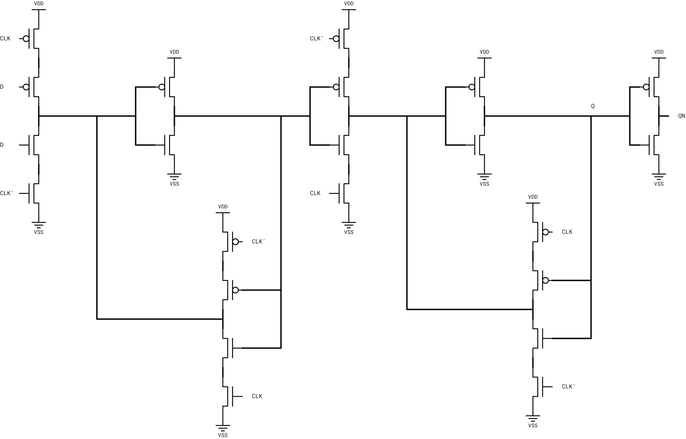
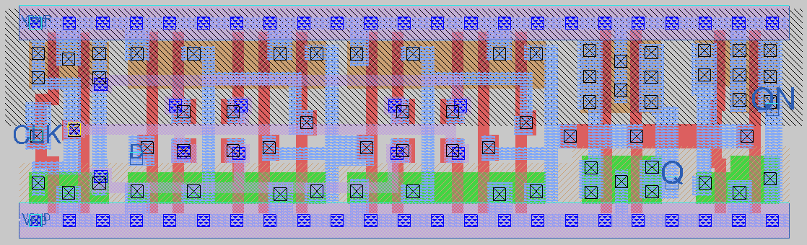
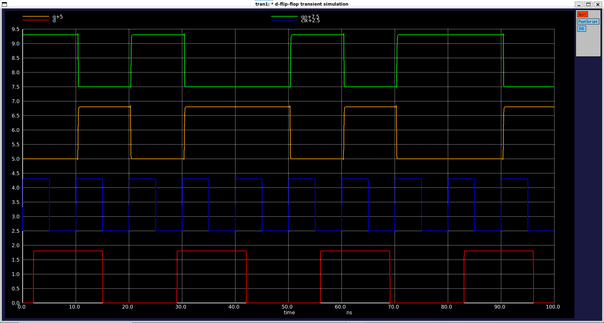
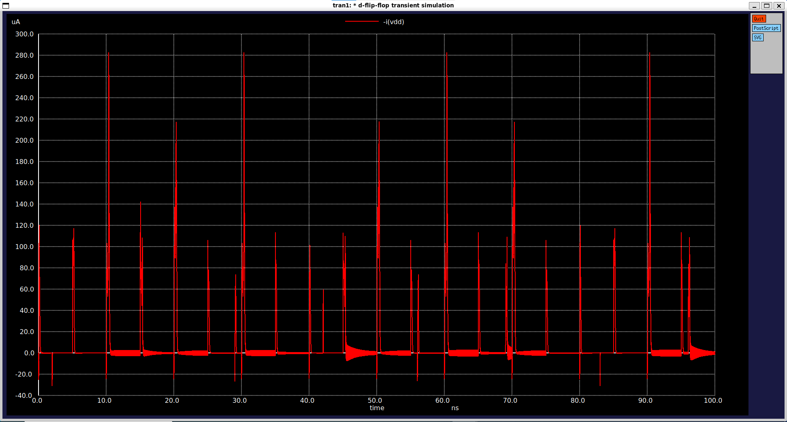

# CMOS D-Flip-Flop Standard Cell (`sky130_myscl_dfq`)

Edge-triggered D-type flip-flop standard cell designed from scratch using the Sky130 PDK, fully compatible with the standard cell library grid and OpenLane flow.

---

## Overview

| Parameter | Value |
|---|---|
| **Function** | Positive edge-triggered data storage (Q = D on clock rising edge) |
| **Topology** | Master-slave transmission-gate / complementary CMOS flip-flop architecture |
| **Standard Height** | 2.72 µm |
| **Cell Width** | 10.58 µm (23 tracks) |
| **Transistor Count** | 32 (16 PMOS, 16 NMOS) |
| **Transistor Sizing ($W_p$ / $W_n$)** | 0.64 µm / 0.42 µm |
| **Input Capacitance_D (C_in)** | ≈ 1.65fF (Rise: 1.63 fF, Fall: 1.68 fF) |
| **Input Capacitance_CLK (C_in)** | ≈ 1.87fF (Rise: 1.76 fF, Fall: 1.98 fF) |
| **Max Transient Current** | ≈ 280 µA (peak during switching/clock edges) |

---

## Circuit Schematic & Operation

The cell implements a master-slave configuration using transmission gates and back-to-back inverter latches. Input data is captured on the rising edge of the clock signal and stably propagated to the output terminals (Q and QN).

 

---

## Layout

---

## Verification & Simulation Results

The cell was verified using ngspice transient analysis across the standard process corners (`tt_025C_1v80`).

### Transient Response & Dynamic/Static Current
* **Signal Integrity:** Clock, data input (D), and output waveforms (Q, QN)) demonstrate correct edge-triggered storage behavior with clean level transitions and minimal propagation delay.
* **Power Dissipation:** Static leakage current is maintained near zero during steady-state retention phases. During clock edges and data transitions, transient switching currents peak at approximately 280 µA.

  