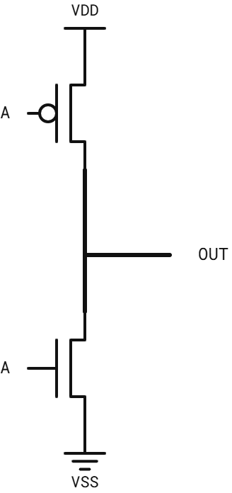
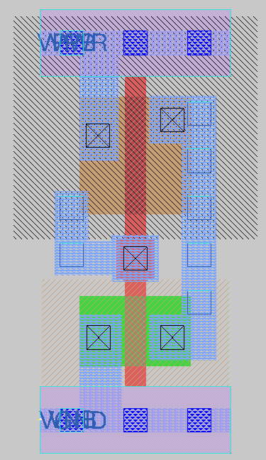
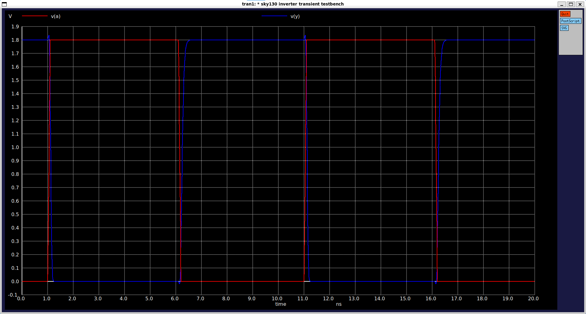
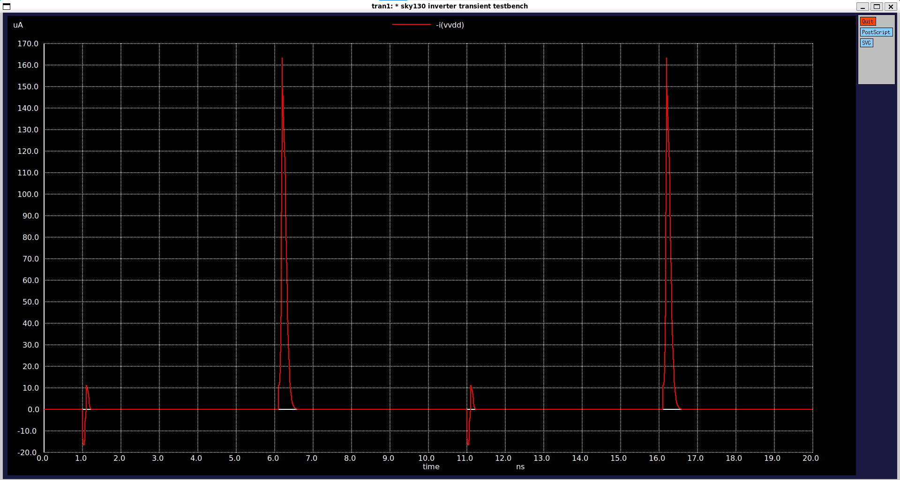
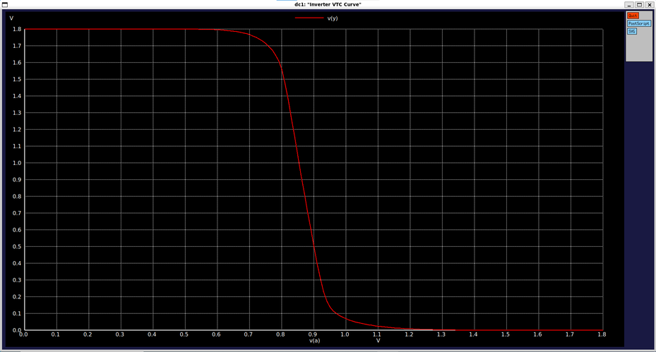
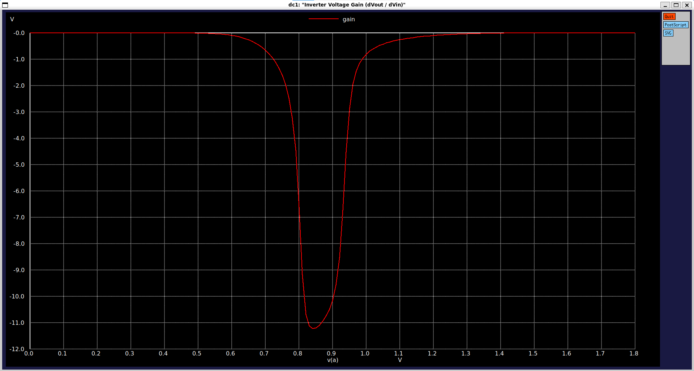

# CMOS Inverter (`sky130_myscl_inv`)

Basic static CMOS inverter cell designed from scratch using the Sky130 PDK, fully compatible with the standard cell library grid and OpenLane flow.

---

## Overview

| Parameter | Value |
|---|---|
| **Function** | Y = !A |
| **Topology** | Complementary CMOS |
| **Standard Height** | 2.72 µm |
| **Cell Width** | 1.38 µm (3 tracks) |
| **Transistor Count** | 4 (2 PMOS, 2 NMOS) |
| **Transistor Sizing ($W_p$ / $W_n$)** | 0.845 µm / 0.5 µm|
| **Input Capacitance (C_in)** | ≈ 2.39fF (Rise: 2.38 fF, Fall: 2.40 fF) |
| **Transistor Count** | 4 (2 PMOS, 2 NMOS) |
| **Switching Threshold ($V_M$)** | ≈ 0.87V |
| **Peak DC Gain** |-11.5|
| **Max Transient Current** | ≈ 165 µA (peak during switching)|

---

## Circuit Schematic & Operation

The cell consists of a single pull-up PMOS and a pull-down NMOS transistor connected in a standard inverter configuration. Sizing has been balanced to compensate for hole/electron mobility differences, ensuring a symmetrical voltage transfer characteristic (VTC).

 

---

## Layout

---

## Verification & Simulation Results

The cell was verified using ngspice across DC sweep and transient analyses (`tt_025C_1v80` corner).

### 1. Transient Response & Dynamic/Static Current
* **Signal Integrity:** Output voltage swing follows the input edges cleanly with minimal propagation delay and zero ringing.
* **Power Dissipation:** Steady-state static current is effectively zero. During state transitions, a natural transient crowbar/charging current peak of roughly 165,uA is observed, which is standard for sub-micron CMOS switching.

  

### 2. VTC and Voltage Gain
* **Switching Threshold:** The VTC curve demonstrates a sharp, clean transition right around the midpoint of the 1.8V rail.
* **DC Gain:** Peak differential gain reaches approximately -11.5, providing excellent noise margins and sharp digital signal restoration.

 

---