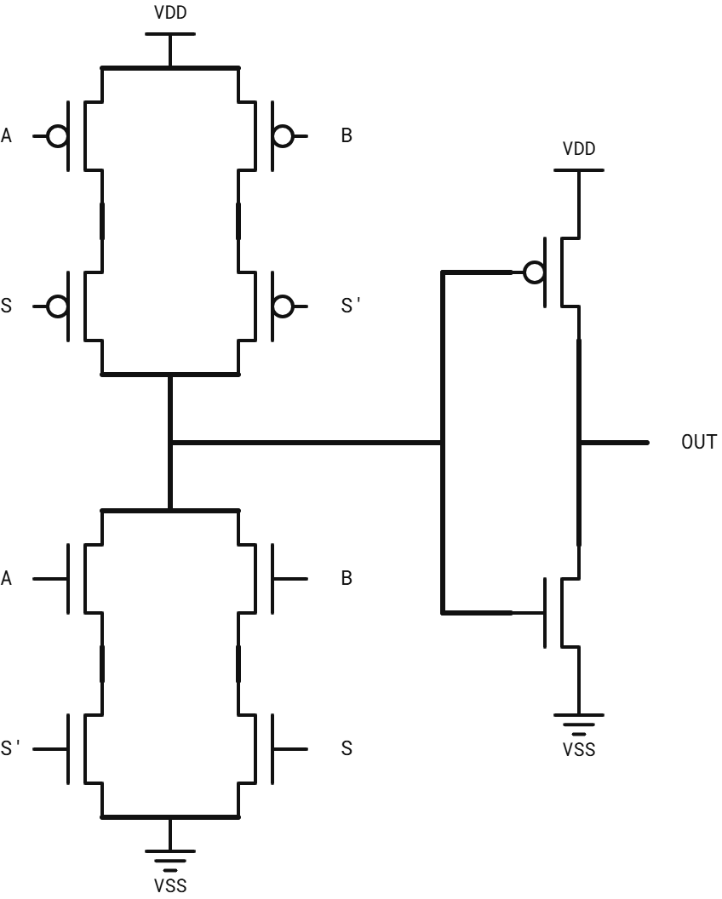
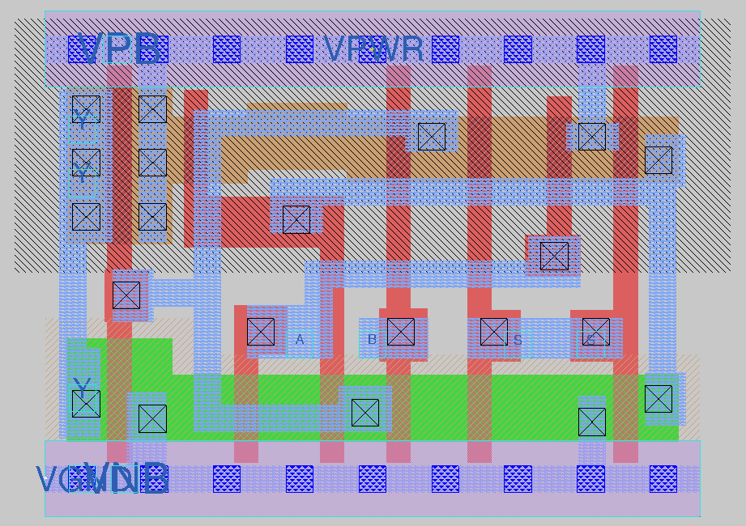
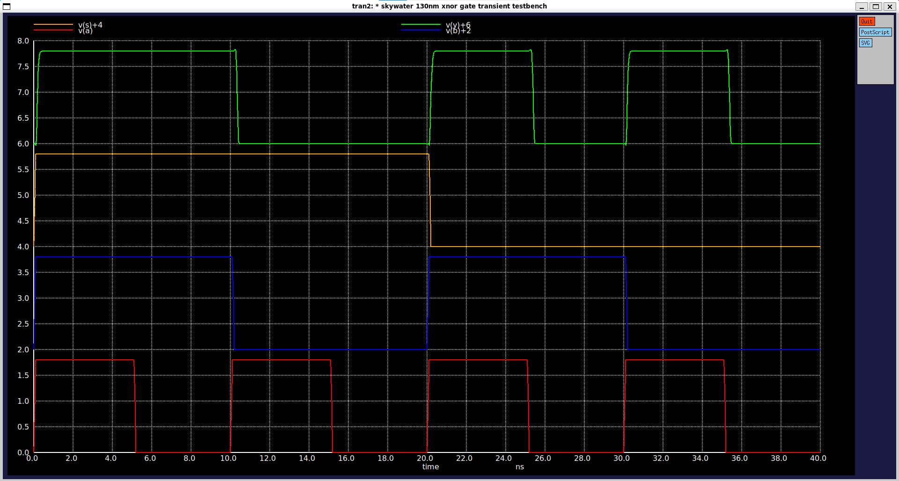
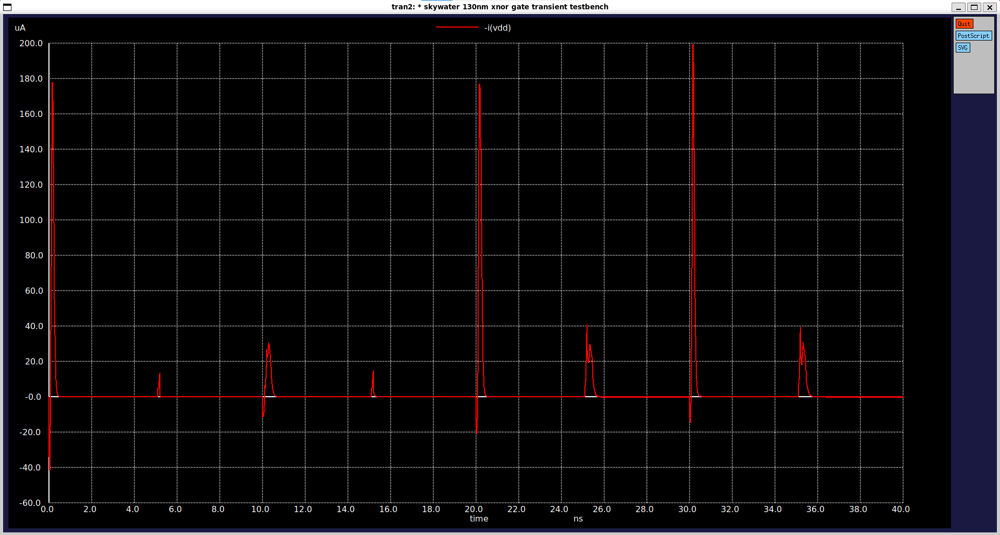
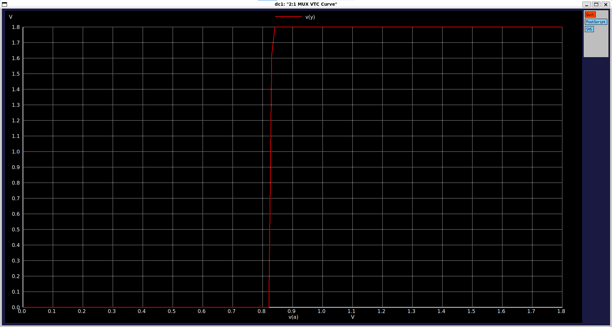
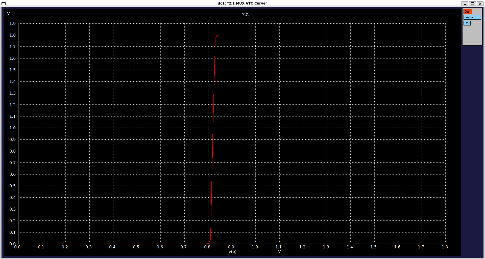
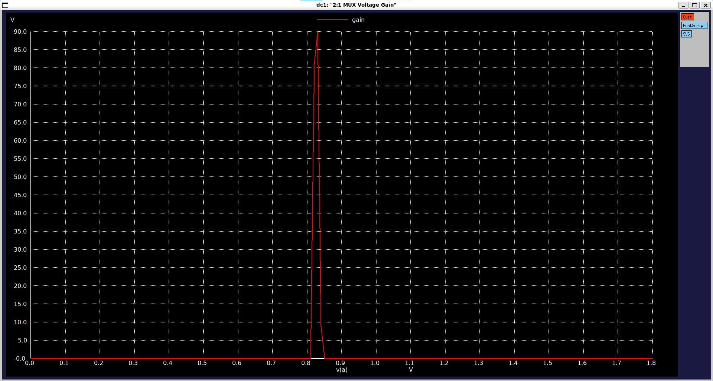

# CMOS 2:1 Multiplexer Standard Cell (`sky130_myscl_mux2`)

Basic 2:1 multiplexer standard cell designed from scratch using the Sky130 PDK, fully compatible with the standard cell library grid and OpenLane flow.

---

## Overview

| Parameter | Value |
|---|---|
| **Function** | Y = S.A + !S.B |
| **Topology** | Complementary CMOS architecture |
| **Standard Height** | 2.72 µm |
| **Cell Width** | 4.14 µm (9 tracks) |
| **Transistor Count** | 12 (6 PMOS, 6 NMOS) |
| **Transistor Sizing ($W_p$ / $W_n$)** | 0.42 µm / 0.42 µm (For Logic), 1 µm / 0.65 µm (For Driver)|
| **Input Capacitance_A (C_in)** | ≈ 1.73fF (Rise: 1.68 fF, Fall: 1.78 fF) |
| **Input Capacitance_B (C_in)** | ≈ 1.28fF (Rise: 1.25 fF, Fall: 1.31 fF) |
| **Input Capacitance_S (C_in)** | ≈ 2.82fF (Rise: 2.73 fF, Fall: 2.90 fF) |
| **Switching Threshold ($V_M$)** | ≈ 0.83V |
| **Peak DC Gain** | ≈ 87 |
| **Max Transient Current** | ≈ 200 µA (peak during switching) |

---

## Circuit Schematic & Operation

The cell implements a 2-to-1 multiplexer using optimized transmission gates and complementary CMOS structures. Depending on the select signal, one of the data inputs is routed to the output with strong signal regeneration.

 

---

## Layout

---

## Verification & Simulation Results

The cell was verified using ngspice across DC sweep and transient analyses (`tt_025C_1v80` corner).

### 1. Transient Response & Dynamic/Static Current
* **Signal Integrity:** Output voltage and input switching waveforms demonstrate correct logic selection and clean signal propagation.
* **Power Dissipation:** Static current remains near zero during steady-state conditions, while transient switching current peaks reach approximately 200 µA.

  

### 2. VTC and Voltage Gain
* **Switching Threshold:** The VTC curves for inputs A and B display sharp transition characteristics centered around 0.83V.
* **DC Gain:** Differential voltage gain reaches a sharp peak of roughly 87 for both input paths, ensuring robust level restoration.

 
 