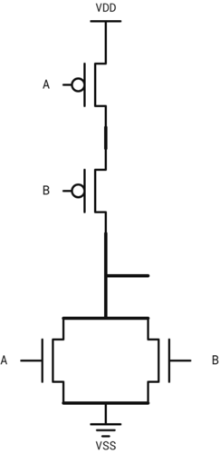
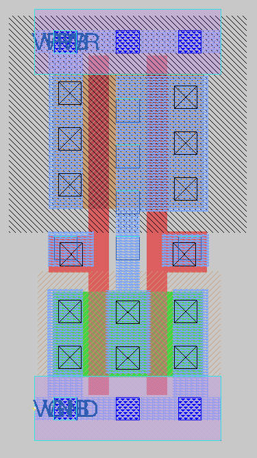
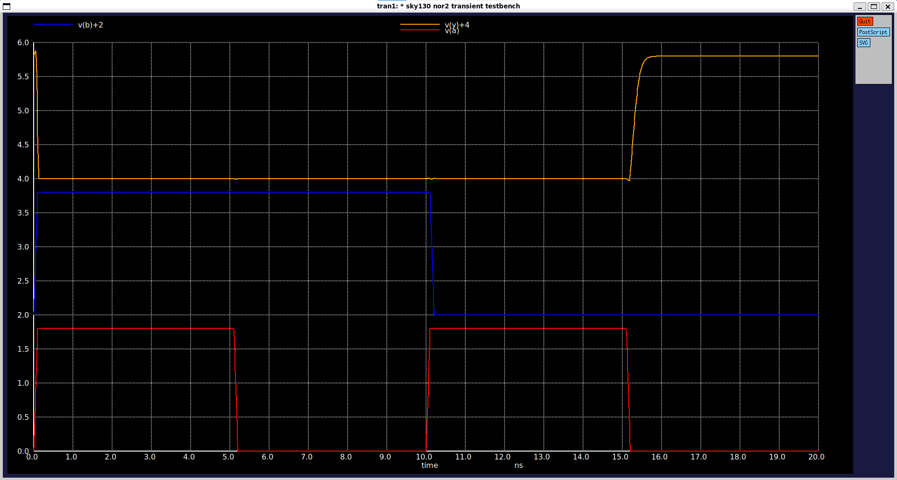
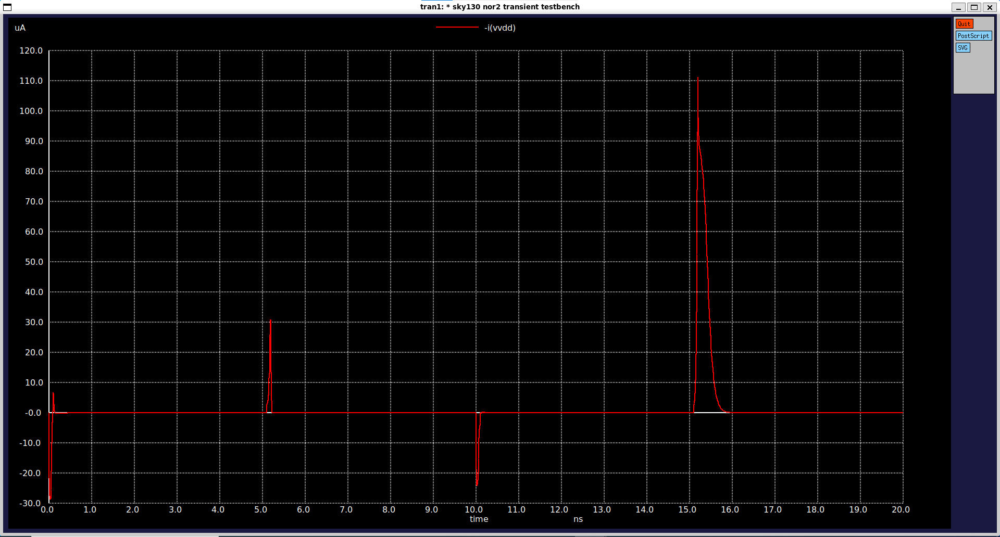
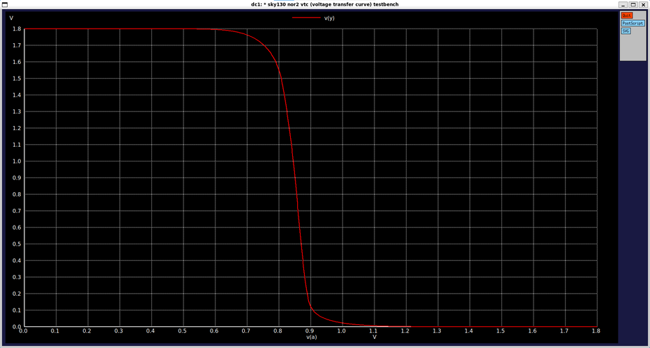
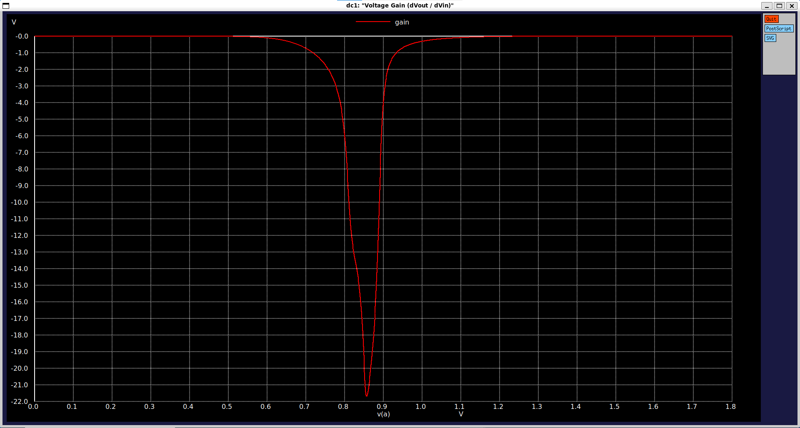

# CMOS 2-Input NOR Gate (`sky130_myscl_nor2`)

Basic 2-input NOR standard cell designed from scratch using the Sky130 PDK, fully compatible with the standard cell library grid and OpenLane flow.

---

## Overview

| Parameter | Value |
|---|---|
| **Function** | Y = !(A + B) |
| **Topology** | Complementary CMOS (2 PMOS series, 2 NMOS parallel) |
| **Standard Height** | 2.72 µm |
| **Cell Width** | 1.38 µm (3 tracks) |
| **Transistor Count** | 4 (2 PMOS, 2 NMOS) |
| **Transistor Sizing ($W_p$ / $W_n$)** | 1 µm / 0.63 µm|
| **Input Capacitance_A (C_in)** | ≈ 2.35fF (Rise: 2.32 fF, Fall: 2.39 fF) |
| **Input Capacitance_B (C_in)** | ≈ 2.13fF (Rise: 2.08 fF, Fall: 2.22 fF) |
| **Switching Threshold ($V_M$)** | ≈ 0.86V |
| **Peak DC Gain** | ≈ -21.5$ |
| **Max Transient Current** | ≈ 110 µA (peak during switching) |

---

## Circuit Schematic & Operation

The cell consists of two series pull-up PMOS transistors and two parallel pull-down NMOS transistors. When either input is high, the output pulls down to ground; otherwise, it is pulled high.

 

---

## Layout

---

## Verification & Simulation Results

The cell was verified using ngspice across DC sweep and transient analyses (`tt_025C_1v80` corner).

### 1. Transient Response & Dynamic/Static Current
* **Signal Integrity:** Output voltage and input switching waveforms demonstrate correct logic operation with clean transitions.
* **Power Dissipation:** Static current is virtually zero in steady-state conditions. During input transitions, transient switching current peaks reach approximately 110 µA.

  

### 2. VTC and Voltage Gain
* **Switching Threshold:** The VTC curve shows a sharp, well-defined transition centered around 0.86V.
* **DC Gain:** Peak differential voltage gain reaches approximately -21.5, providing strong signal restoration and high noise immunity.

 