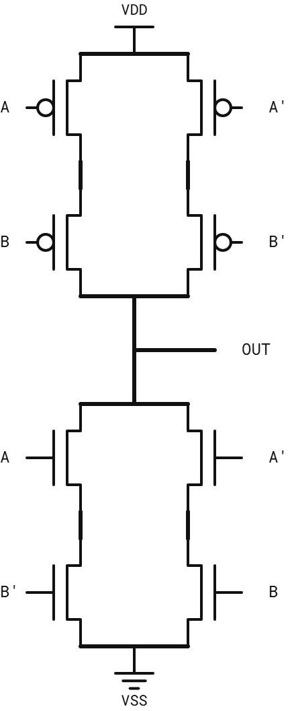
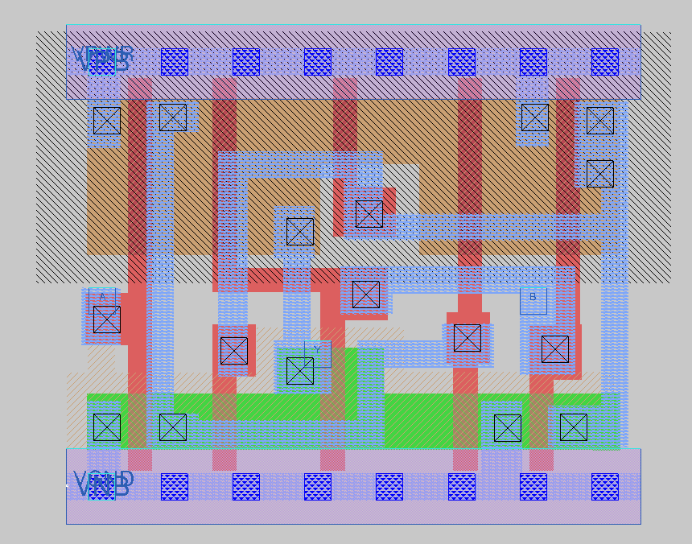
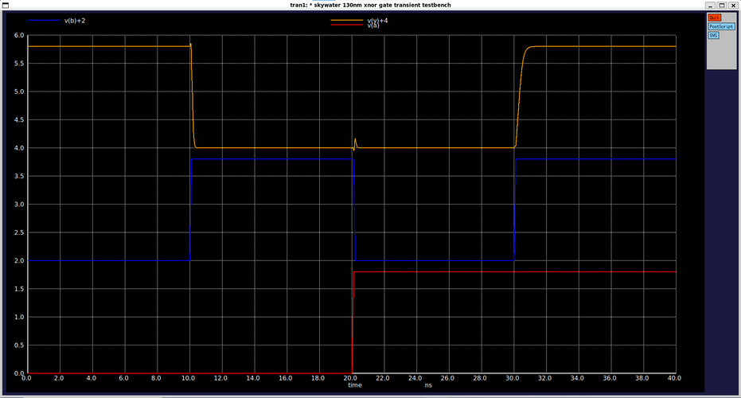
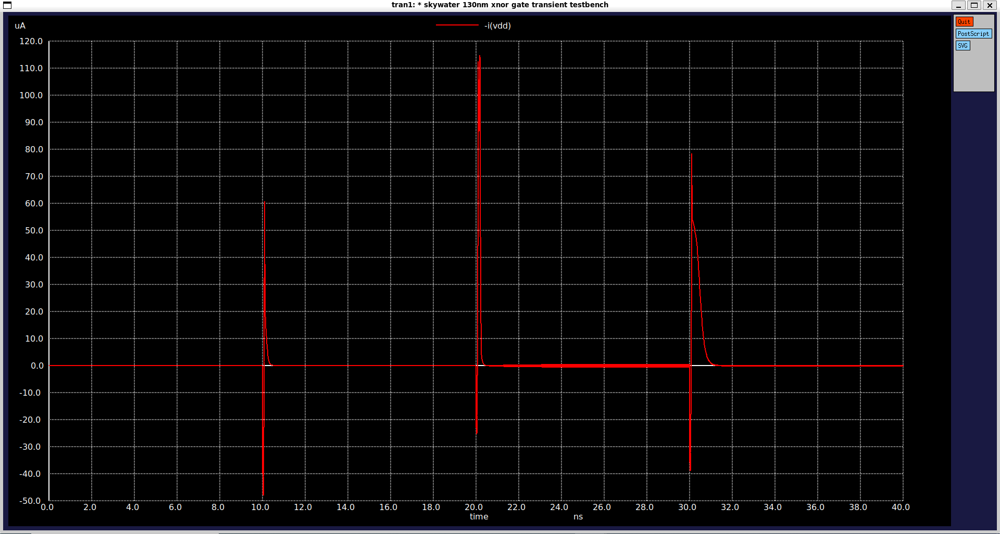
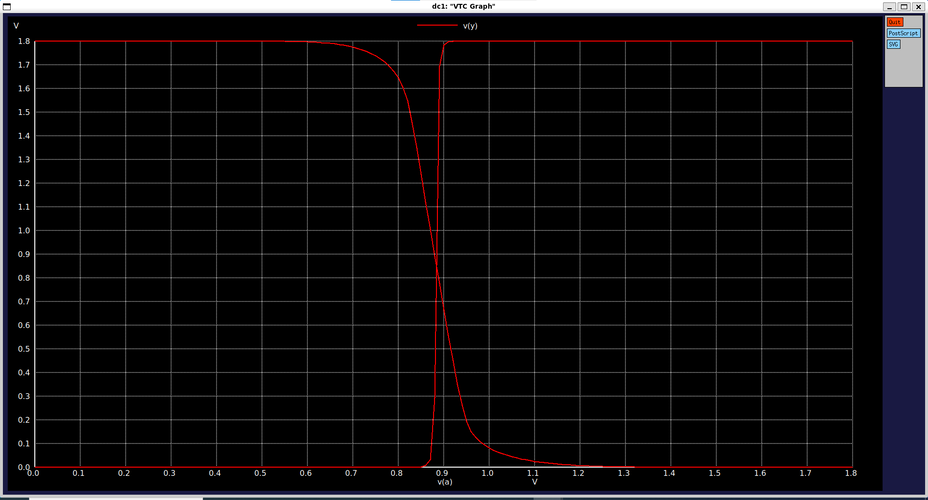
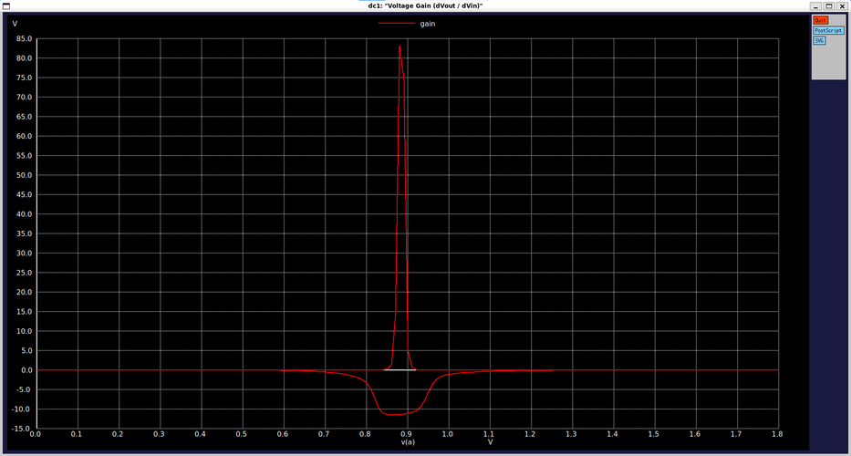

# CMOS 2-Input XNOR Gate (`sky130_myscl_xnor2`)

Basic 2-input XNOR standard cell designed from scratch using the Sky130 PDK, fully compatible with the standard cell library grid and OpenLane flow.

---

## Overview

| Parameter | Value |
|---|---|
| **Function** | Y = !(A ⨁ B) |
| **Topology** | Complementary CMOS Architecture |
| **Standard Height** | 2.72 µm |
| **Cell Width** | 3.68 µm (8 tracks) |
| **Transistor Count** | 10 (5 PMOS, 5 NMOS) |
| **Transistor Sizing ($W_p$ / $W_n$)** | 1 µm / 0.36 µm (For A), 1 µm / 0.36 µm and 1 um / 0.65 µm (For B)|
| **Input Capacitance_A (C_in)** | ≈ 2.00fF (Rise: 1.94 fF, Fall: 2.06 fF) |
| **Input Capacitance_B (C_in)** | ≈ 4.67fF (Rise: 4.60 fF, Fall: 4.75 fF) |
| **Switching Threshold ($V_M$)** | ≈ 0.88V |
| **Peak DC Gain** | ≈ +82 / -12 |
| **Max Transient Current** | ≈ 118 µA (peak during switching) |

---

## Circuit Schematic & Operation

The cell implements the exclusive-NOR logical function using optimized CMOS and transmission-gate logic structures. When inputs match, the output pulls high; when inputs differ, the output pulls low.

 

---

## Layout

---

## Verification & Simulation Results

The cell was verified using ngspice across DC sweep and transient analyses (`tt_025C_1v80` corner).

### 1. Transient Response & Dynamic/Static Current
* **Signal Integrity:** Output voltage and input switching waveforms demonstrate correct logic operation and clean level propagation.
* **Power Dissipation:** Static current remains near zero during steady-state conditions, while transient switching current peaks reach approximately 118 µA.

  

### 2. VTC and Voltage Gain
* **Switching Threshold:** The VTC curves display sharp transition characteristics centered around 0.88V.
* **DC Gain:** Differential voltage gain reaches a sharp positive peak of roughly +82 and a negative dip of -12, ensuring robust signal regeneration.

 